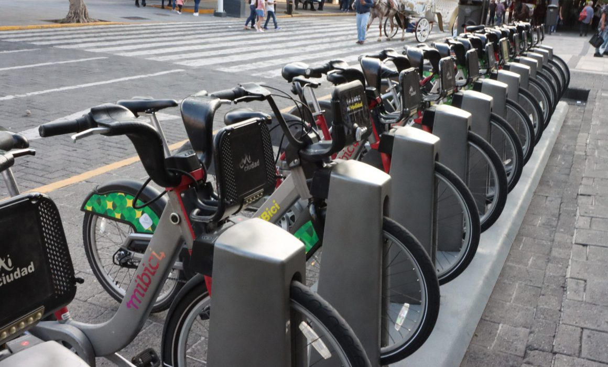

# Bicycle Network Enhancement in Jalisco

  <em> Photo: Guadalajara's Government </em>

This project was realized using open data by [MiBici](https://www.mibici.net/) public's service

__Authors__: [Manuel Solano](https://github.com/manuelsolan-o), [Alejandra Velaco](https://github.com/Aleevz), [José Carlos Yamuni](https://github.com/josecyamuni), [Antonio Juaréz](https://github.com/JAJP2203)

## Assumptions

For practical purposes, we simplified the algorithm's complexity.

This solution is aiming the scenario of having limited bicycles, thus finding the optimal bicycle distribution for each station using a genetic algorithm.

In reality, this problem is exceptionally intricate, demanding extensive efforts and a multi-faceted approach to tackle its complexity effectively. Our team acknowledges the intricate nature of bicycle distribution within the constrained framework of limited resources. The continued development and refinement of the solution will require ongoing collaboration, in-depth data analysis, and the exploration of advanced optimization techniques. As we navigate this challenging terrain, we remain committed to enhancing transportation efficiency, and we are dedicated to furthering our efforts in addressing the complexities inherent to this unique problem.

## App

## Installation

### Step 0)

Clone this repository

### Step 1)

To install the libraries needed to run the app, we need to write the following in the terminal:

    pip install -r requirements.txt

OR

    pip3 install -r requirements.txt

### Step 2)
Run the app.py file from the directory where the repository has been cloned

    streamlit run app.py

